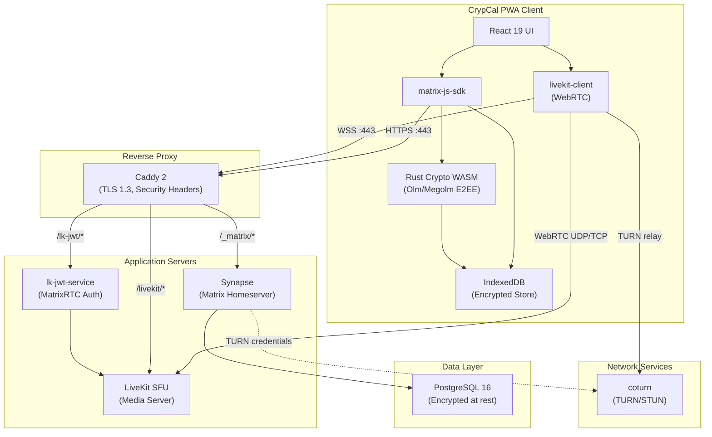
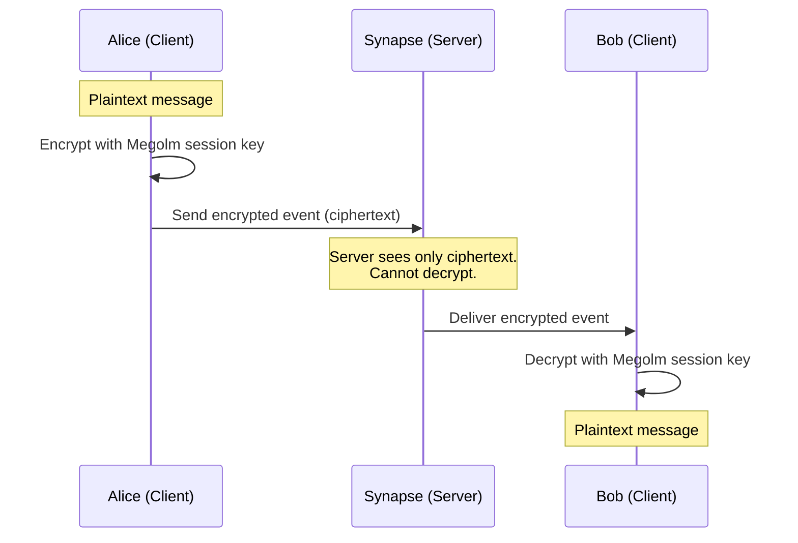
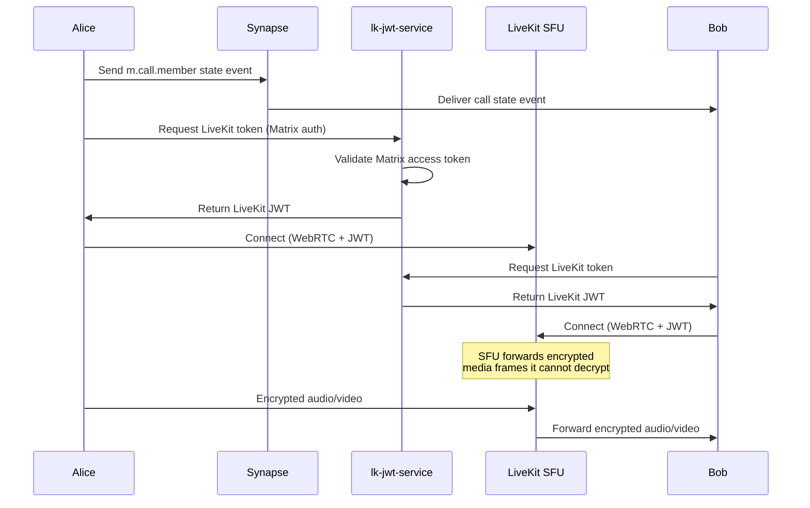

# CrypCal Architecture

## System Overview

CrypCal is a self-hostable, end-to-end encrypted chat and calling application built on the Matrix protocol. All server components run as Docker containers orchestrated by Docker Compose.

## Component Diagram



## Data Flow

### Message Flow (E2EE)



### Call Flow (MatrixRTC + LiveKit)



## Security Architecture

### Trust Boundaries

1. **Client boundary**: The client holds all encryption keys. E2EE happens entirely within the client. The server never has access to plaintext content.
2. **Server boundary**: The server processes encrypted events and metadata (timestamps, room membership, typing indicators). It cannot read message content or media.
3. **Network boundary**: All traffic is TLS 1.3 encrypted. WebRTC media uses DTLS-SRTP with additional E2E encryption via insertable streams.

### Key Management

- **Olm**: 1:1 ratcheting protocol for key exchange between devices
- **Megolm**: Group encryption for room messages (one key per session)
- **Cross-signing**: Device verification chains anchored to a master signing key
- **Key backup**: Encrypted server-side backup with user-held recovery key (AES-256)

### What the Server Operator Can See

| Data | Visible to Server? |
|------|:------------------:|
| Message content | ❌ No |
| File content | ❌ No |
| Call audio/video | ❌ No |
| Who is talking to whom | ✅ Yes (room membership) |
| When messages are sent | ✅ Yes (timestamps) |
| Message size | ✅ Yes (ciphertext length) |
| User presence/online status | ✅ Yes |
| Device IDs | ✅ Yes |
| IP addresses | ⚠️ Minimized (rate-limiting only) |

## Directory Structure

```
CrypCal/
├── apps/web/              # React PWA client
│   ├── src/
│   │   ├── components/    # UI components
│   │   ├── hooks/         # React hooks (rooms, timeline, call)
│   │   ├── lib/           # Core: Matrix client, store, encryption
│   │   └── utils/         # Helpers
│   └── public/            # Static assets, PWA manifest
├── infra/                 # Docker Compose infrastructure
│   ├── caddy/             # Reverse proxy config
│   ├── synapse/           # Homeserver config
│   ├── coturn/            # TURN/STUN config
│   ├── livekit/           # SFU config
│   └── postgres/          # Database init
├── scripts/               # Setup, perf, TLS check
└── docs/                  # Documentation
```
